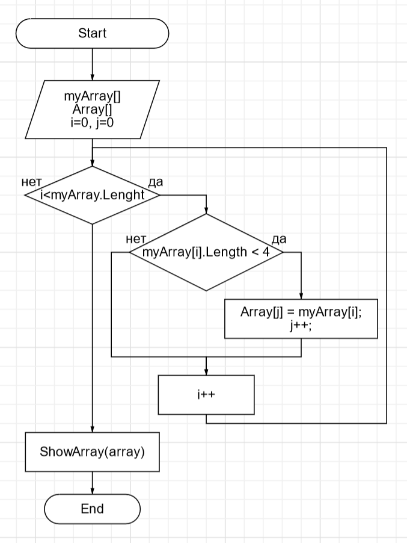

# Итоги блока. Выбор специализации. IT-специалист

## Домашнее задание

### Условие задачи:

    Написать программу, которая из имеющегося массива строк формирует новый массив из строк, длина которых меньше, либо равна 3 символам. 
    Первоначальный массив можно ввести с клавиатуры, либо задать на старте выполнения алгоритма. При решении не рекомендуется пользоваться коллекциями, 
    лучше обойтись исключительно массивами.

    Примеры:
    [“Hello”, “2”, “world”, “:-)”] → [“2”, “:-)”]
    [“1234”, “1567”, “-2”, “computer science”] → [“-2”]
    [“Russia”, “Denmark”, “Kazan”] → []

### Блок-схема решения задачи

### Решение задачи

    1. Объявляем переменные.
    2. Вводим данные первого массива, описываем массив для результатов и счётчики
    3. Проверяем элемны массива на соответствие условию задачи (элемент меньше 4 символов).
    4. Для проверки элементов массива используем счетчик.
    5. Выводим новый массив с полученными элементами.